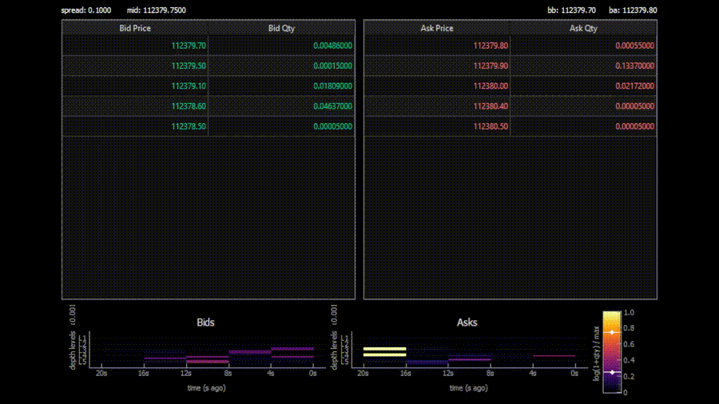

# Binance Order Book Engine


What initially began as a simple-console based order book engine in C++ slowly evolved into a real-time streaming system that pulls live L2 depth data from Binance, pushes it through Kafka, and visualizes with a custom Python GUI. 

This project became my first true end-to-end build, combining C++ networking, Kafka streaming, and Python visualization into one working system. 

## DEMO



## Prerequisites

- Docker Desktop (for Kafka + Zookeeper)
- CMake + a C++ 17 Compiler (tested with MSVC 2022)
- Python 3.10+
- pip/venv for Python dependencies
- (Note: Additional Python dependencies are listed in [requirements.txt](./src/visualizepython/requirements.txt)

## Downloading 
```bash
git clone https://github.com/yourusername/BinanceOrderBookEngine.git
cd BinanceOrderBookEngine
```
## Setup 

### Start Kafka + Zookeeper
```bash
docker compose up -d
```
### Build and Run C++ Producer 
```bash
cd src/orderbook
mkdir build && cd build
cmake ..
cmake --build .
./orderbook_producer
```
### Run Python Visualizer
```bash
cd src/visualizepython
python -m venv .venv
.venv\Scripts\activate   # (FOR WINDOWS)
pip install -r requirements.txt
python main.py
```
## Third-Party Libraries
This project makes use of the following open-source libraries: 
- [nlohmann/json](https://github.com/nlohmann/json) (MIT License)  
- [binapi](https://github.com/niXman/binapi) (see repo for license)  
- [pyqtgraph](https://www.pyqtgraph.org/) (MIT License)  
- [PyQt5](https://pypi.org/project/PyQt5/) (GPL / commercial, free for open use)  
- [kafka-python](https://github.com/dpkp/kafka-python) (Apache 2.0 License)  
- [numpy](https://numpy.org/) (BSD License)  

